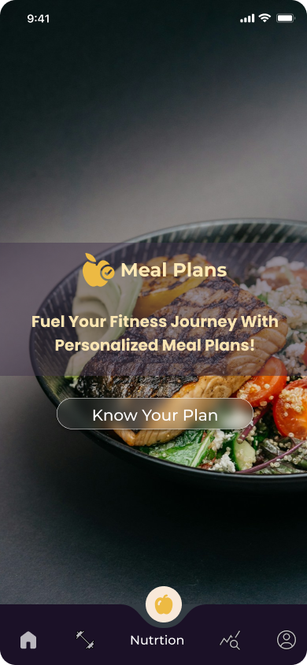
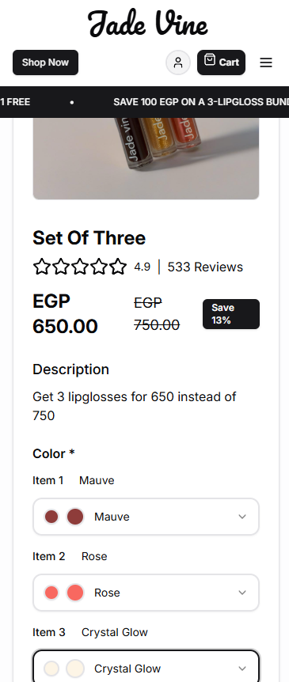

# MaVoid Online Portfolio

<p align="center">
  
</p>
<p align="center">
  
</p>
<p align="center">
  
</p>
<p align="center">
  
</p>

The public portfolio site for MaVoid — a filterable gallery of the work and products, in one place.

Built so someone landing from LinkedIn or a pitch can browse the projects without asking for a deck.

- Filter MaVoid work by category
- A clean Next.js site you can run locally
- Same brand as [mavoid.com](https://mavoid.com)

```bash
pnpm install
pnpm dev
```

---

Built by [Ziad Ahmed](https://github.com/Ziad-NasrEldin) at [MaVoid](https://mavoid.com).

[Website](https://mavoid.com) · [LinkedIn](https://linkedin.com/in/ziad-ahmed-634202332) · [GitHub](https://github.com/Ziad-NasrEldin)
